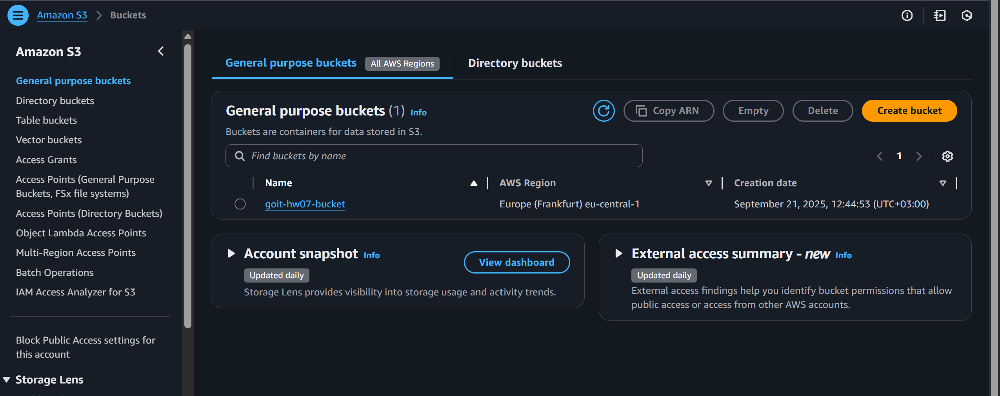
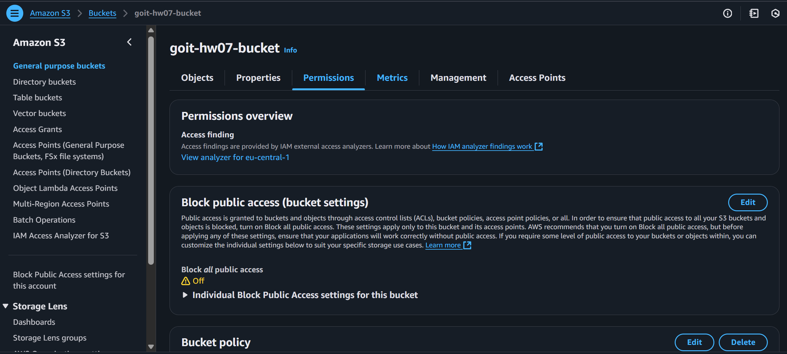
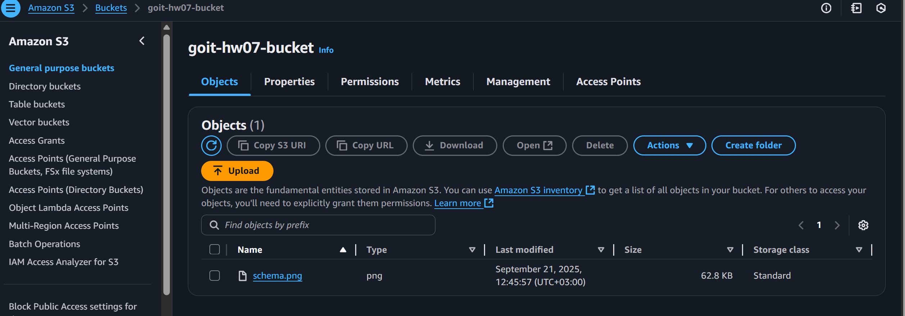
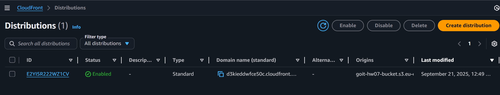
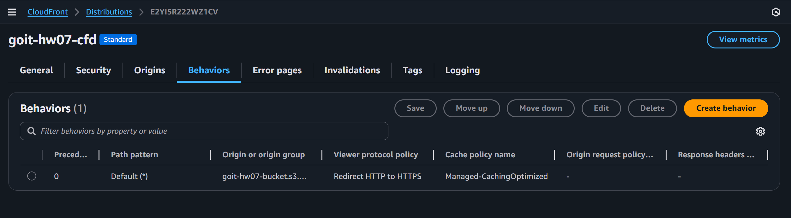
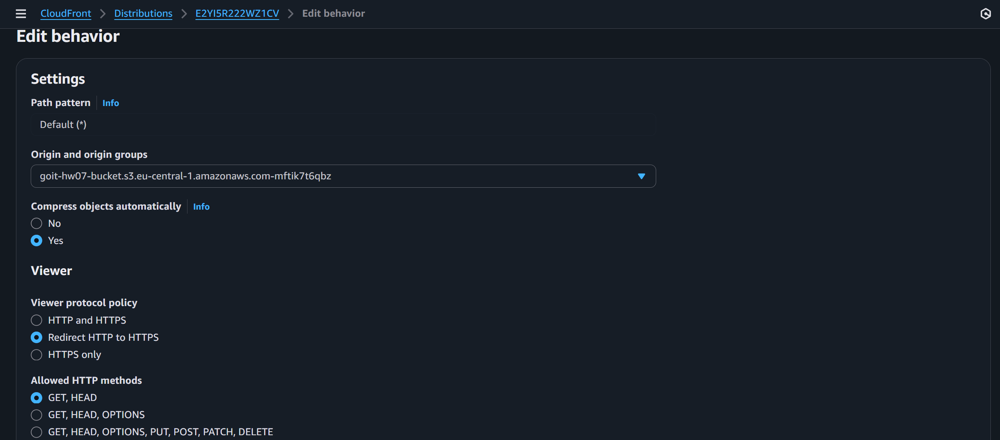
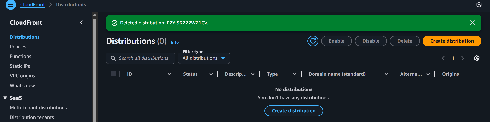
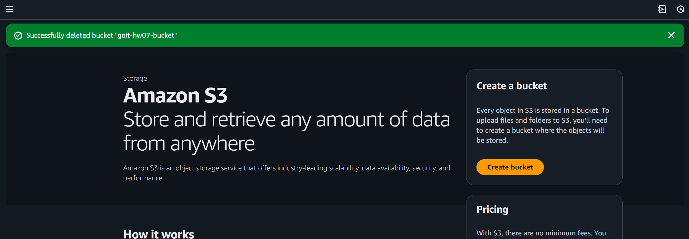

# goit-cloud-hw-07

1. Створення S3-бакету

Відкрити AWS S3 → Buckets.

2. Налаштування публічного доступу до S3

Відкрити Permissions у створеному S3-бакеті.

3. Завантаження файлу в S3

Відкрити створений S3-бакет → Objects.

 4. Створення CloudFront-дистрибуції

Відкрити AWS CloudFront → Distributions.

5. Перевірку політики кешування та доступу

Відкрити CloudFront → Distributions → Ваш Distribution → Behaviors.

-->  
Cache policy (CachingOptimized) та Allowed HTTP methods (GET, HEAD).

6. Видалення ресурсів

Відкрити CloudFront → Distributions.

Відкрити S3 → Buckets, очистити бакет, видалити його.

